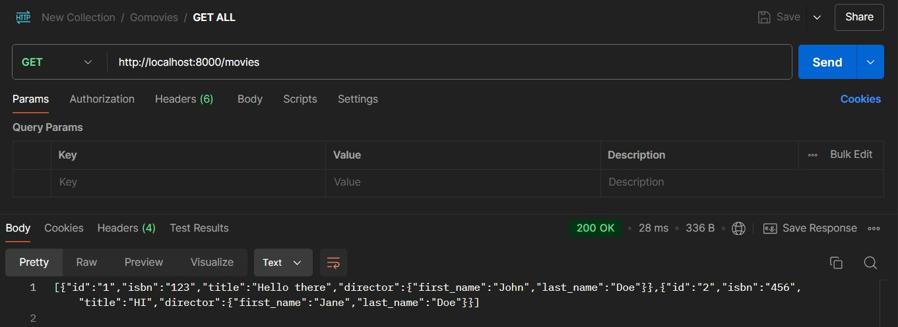
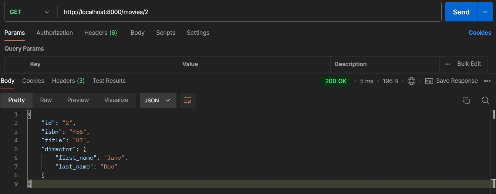
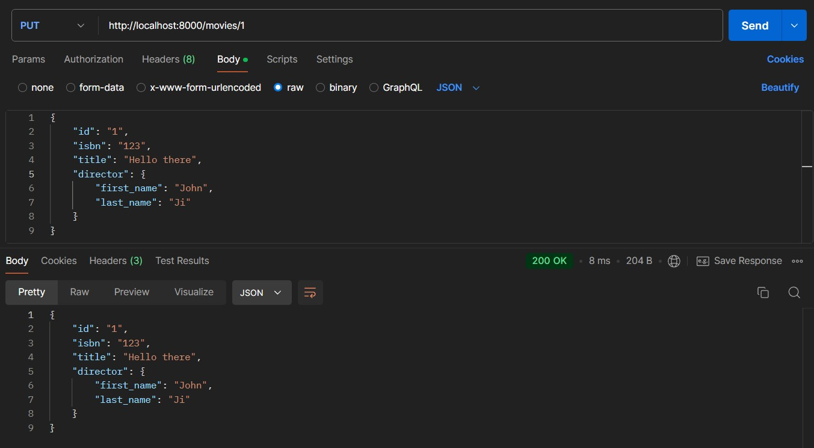
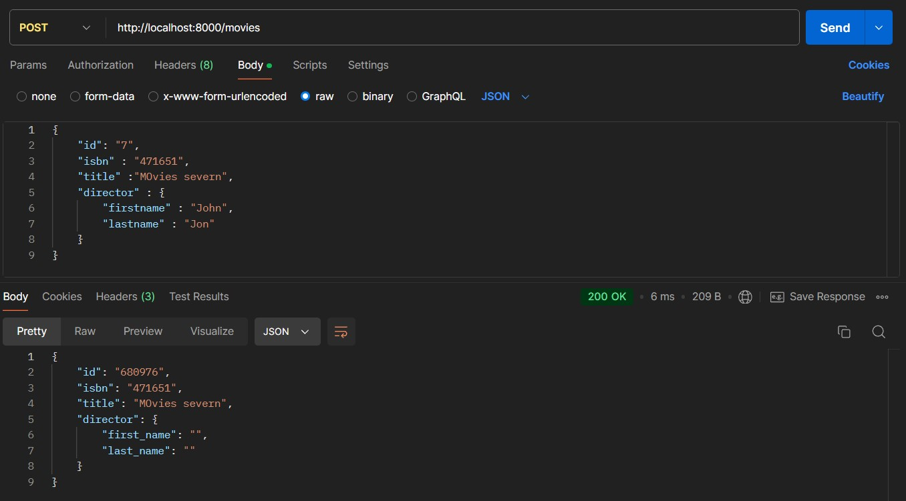
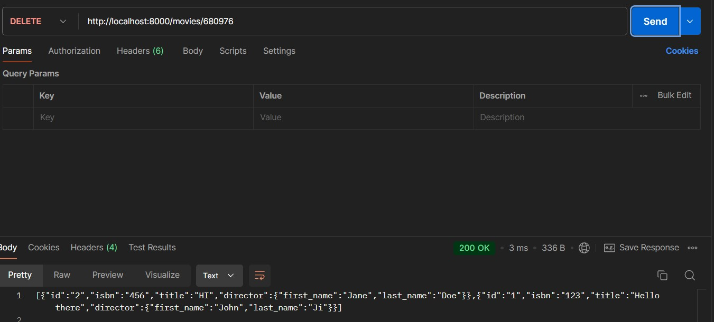

# Movies CRUD Server

Make a simple CRUD (Create , Read , Update , Delete) that has a movie database but instead of a database , due to it small scale, we will store the database in the form of a json and will use [Postman](https:/www.postman.com/).
A CRUD Server has the following options to alter or change the database:

- PUT
- GET
- DELETE
- POST

## Dependency
Requires the Postman desktop app
## Setting in Postman
Create a new folder with some name and add the following request

- GET ALL
	set it to GET and specify the path as http://localhost:8000/movies.
	
- GET BY ID
	set it to GET and specify the path as http://localhost:8000/movies/n where n is the id given to a movie.
	
- UPDATE
	set it to PUT and specify the path as http://localhost:8000/movies/n  where n is the id of the data you want to update and create a new json with updated value
	
- CREATE
	set it to POST and specify the path as http://localhost:8000/movies/n  where n is the id of the data you want to create , the id is randomly generated
	
- DELETE
	set it to DELETE and specify the path as http://localhost:8000/movies/n  where n is the id of the data you want to delete

